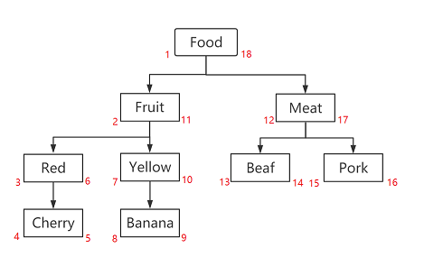

# How It Works

## Basic Concepts

When developing a `Nodejs` application that needs to store a tree in a database, the following storage structures are commonly used:

- Adjacency List
- Path Enumeration
- Nested Set Model
- Closure Table

Each of these algorithms has its pros and cons; you should choose the right one based on your actual scenario.

The `Nested Set Model` is also known as the `Left-Right Value` model. It is a method for storing tree-structured data, using two fields (commonly called `lft` and `rgt`) to represent a node's position in the tree.

In the Nested Set Model, every node's `lft` value is smaller than the `lft` values of all its children, and its `rgt` value is larger than the `rgt` values of all its children. This way, we can fetch all descendants of a node with a single query—just look for all nodes whose `lft` and `rgt` values fall within that range.

The left/right value layout of the Nested Set Model is determined through `Depth-First Search (DFS)`. During the traversal, a `lft` value is assigned every time we enter a node, and a `rgt` value is assigned every time we leave a node. Each node's `lft` and `rgt` values thus form an interval, and every value within that interval corresponds to a child of that node.



For example, here is a sample Nested Set Model:


| id | leftValue | rightValue | name |
|----|-----|-----|------|
| 1  | 1   | 14  | root |
| 2  | 2   | 9   | A    |
| 3  | 10  | 11  | B    |
| 4  | 12  | 13  | C    |
| 5  | 3   | 4   | A-1  |
| 6  | 5   | 6   | A-2  |
| 7  | 7   | 8   | A-3  |
 
This table represents the following tree structure:

<LiteTree>
- root
    - A
        - A-1
        - A-2
        - A-3
    - B
    - C
</LiteTree>

## Extension

`FlexTree` is a tree-storage management component built on the `Left-Right Value` algorithm, developed in `Typescript`, applicable to any database scenario, and wrapping various easy-to-use APIs.

On top of the `Left-Right Value` algorithm, `FlexTree` adds a `level` field to represent a node's level. With the `level` field, we can more easily obtain the tree's hierarchical structure, as follows:

| id | `level` | leftValue | rightValue | name |
|----|---|-----|-----|------|
| 1  | `0` |  1   | 14  | root |
| 2  | `1` | 2   | 9   | A    |
| 3  | `1` | 10  | 11  | B    |
| 4  | `1` | 12  | 13  | C    |
| 5  | `2` | 3   | 4   | A-1  |
| 6  | `2` | 5   | 6   | A-2  |
| 7  | `2` | 7   | 8   | A-3  |


## Solution Comparison

When storing tree-structured data in a database, the most common solutions are:

- Adjacency List
- Path Enumeration
- Closure Table
- Nested Set Model

### Compared with Adjacency List

In an Adjacency List, each node has a reference pointing to its parent (`pid`). As follows:

| id | pid | name |
|----|-----------|------|
| 1  | NULL      | root |
| 2  | 1         | A    |
| 3  | 1         | B    |
| 4  | 1         | C    |
| 5  | 2         | A-1  |
| 6  | 2         | A-2  |
| 7  | 2         | A-3  |


This approach is simple, intuitive, and the easiest to understand and use, but queries require recursive lookup, which performs poorly.

For example, to implement the following:

- Query all descendants of a node
- Query all ancestors of a node
- Move a subtree under another node
- Delete a node and its descendant subtree

None of these can be done with a simple `1-N` `SQL` statements; they require **recursive queries** at the application layer—the deeper the tree, the worse the performance.

**Performance & Metrics Comparison**

> In the "SQL request count" column below, values are labeled in `FlexTree / comparison` order; `N` means it grows linearly with the depth or size of the tree, and `—` means this item does not involve SQL request count.

| Dimension | FlexTree (Nested Set Model) | Adjacency List | SQL requests (FlexTree / Adjacency List) |
| --- | --- | --- | --- |
| Query descendants | Single SQL, range query on left/right values, efficient | Requires recursive query, slower as depth grows | 1 / N (recursive) |
| Query ancestors | Single SQL, range query on left/right values, efficient | Requires recursive query, slower as depth grows | 1 / N (recursive) |
| Query direct children | Single SQL | Single SQL (filter by `pid`) | 1 / 1 |
| Query parent | Single SQL | Single SQL (filter by `pid`) | 1 / 1 |
| Add node | Needs to update left/right values of related nodes (affects `1-N` rows) | Just `INSERT` 1 row | 2 (update + insert) / 1 |
| Delete subtree | Needs to update left/right values (affects `1-N` rows) | Must recursively fetch descendants first, then delete | 2 (delete + shrink) / N (recursive) |
| Move subtree | Needs to reorder left/right values (affects `1-N` rows) | Just update `pid` (1 row) | 2 / 1 |
| Storage structure | Single table + `leftValue`/`rightValue`/`level` | Single table + `pid` | — |
| Recursion required | No | Yes (when querying) | — |
| Ordered tree | Naturally ordered | Requires an extra `order` field | — |
| Level depth | Bounded by integer range (rarely hit in practice) | Unlimited | — |

### Compared with Path Enumeration

Because of the recursive performance issues of the Adjacency List, the Path Enumeration structure was introduced. Path Enumeration builds on the Adjacency List by adding a `path` field to store the node's path, as follows:


| id | path     | name |
|----|----------|------|
| 1  | /root       | root |
| 2  | /root/A     | A    |
| 3  | /root/B     | B    |
| 4  | /root/C     | C    |
| 5  | /root/A/A-1   | A-1  |
| 6  | /root/A/A-2   | A-2  |
| 7  | /root/A/A-3   | A-3  |

The advantage of this scheme is that querying all descendants of a node only requires querying the `path` field—no recursive query needed. However, it also has downsides when the tree has many levels:

- Query operations are mostly `like` operations on the `path` string, which perform poorly.
- The path can become very long, limiting the tree's depth; an ordinary `VARCHAR` may not be enough, requiring `TEXT`.  
- Choosing which field to concatenate into `path` is an issue.
    - If `name` is used as the `path` field, duplicate names, special characters, or changes in the `name` value can make `path` non-unique or abnormal. Therefore, the field used as `path` should ideally be unique, short, rarely changing, and free of special characters.
    - If `id` (`pk`) is used to compose `path`, since `pk` is unique and relatively stable, it's a better fit for the `path` field. But if the `id` field is a `uuid` type, the `path` becomes very long and query efficiency drops accordingly. 
- Moving a subtree under another node is also relatively simple. For example, **to move /root/A/A-2 to become a child of /root/B**, run the following `SQL`:

```sql
UPDATE tree_table
SET path = REPLACE(path, '/root/A/A-2', '/root/B/A-2')
WHERE path LIKE '/root/A/A-2%';
```

- A Path Enumeration tree table is unordered; to support an ordered tree, an extra `order` field is needed to maintain node order, as follows:

| id | path     | `order` | name |
|----|----------|------|------|
| 1  | /root       | `1` | root |
| 2  | /root/A      |  `2`  | A    |
| 3  | /root/A/A-1  |  `3`   | A-1  |
| 4  | /root/A/A-2   |  `4`  | A-2  |
| 5  | /root/A/A-3   |  `5`  | A-3  |
| 6  | /root/B      |  `6`  | B    |
| 7  | /root/C      |  `7` | C    |

Once `order` turns the tree into an ordered tree, the logic to maintain the `order` field becomes more complex.


In short, we have to weigh the choice of the `path` field and consider the length and query efficiency of `path`. If the field composing `path` (such as `name`) may have duplicates, special characters, or changes, it is not suitable as a `path` field.

**Performance & Metrics Comparison**

| Dimension | FlexTree (Nested Set Model) | Path Enumeration | SQL requests (FlexTree / Path Enumeration) |
| --- | --- | --- | --- |
| Query descendants | Range query on left/right values, index-friendly, efficient | `LIKE` prefix match on `path`, average performance | 1 / 1 |
| Query ancestors | Range query on left/right values, efficient | Needs to parse / split the `path` string | 1 / 1 |
| Add node | Needs to update left/right values (affects `1-N` rows) | `INSERT` + compute `path` by concatenation | 2 (update + insert) / 1 |
| Delete subtree | Needs to update left/right values (affects `1-N` rows) | Delete in one pass via `path LIKE` | 2 (delete + shrink) / 1 |
| Move subtree | Needs to reorder left/right values (affects `1-N` rows) | `REPLACE` all `path`s of the subtree | 2 / 1 |
| Storage overhead | Integer fields, low overhead | `path` string, grows long with depth, may need `TEXT` | — |
| Ordered tree | Naturally ordered | Requires an extra `order` field | — |
| Field choice | Only needs a stable `id` | `path` field needs trade-offs (duplicates, special characters, changes) | — |
| Level depth | Bounded by integer range | Bounded by `path` field length | — |

### Compared with Closure Table

The Closure Table structure needs two tables to represent a tree: one stores node information, and the other stores the relationships between nodes. As follows:

- **Node table**

| id | name |
|----|------|
| 1  | root |
| 2  | A    |
| 3  | B    |
| 4  | C    |
| 5  | A-1  |
| 6  | A-2  |
| 7  | A-3  |

- **Relation table**

| ancestor | descendant | depth |
|----------|------------|-------|
| 1        | 1          | 0     |
| 1        | 2          | 1     |
| 1        | 3          | 1     |
| 1        | 4          | 1     |
| 1        | 5          | 2     |
| 1        | 6          | 2     |
| 1        | 7          | 2     |
| 2        | 2          | 0     |
| 2        | 5          | 1     |
| 2        | 6          | 1     |
| 2        | 7          | 1     |
| 3        | 3          | 0     |
| 4        | 4          | 0     |
| 5        | 5          | 0     |
| 6        | 6          | 0     |
| 7        | 7          | 0     |

- As shown above, to query all descendants of a node, each node must record all its ancestors as well as each node's depth. This requires more storage space and higher maintenance cost.

**Performance & Metrics Comparison**

| Dimension | FlexTree (Nested Set Model) | Closure Table | SQL requests (FlexTree / Closure Table) |
| --- | --- | --- | --- |
| Number of tables | Single table | Two tables (node table + relation table) | — |
| Query descendants | Single SQL, range query | Single SQL, query the relation table | 1 / 1 |
| Query ancestors | Single SQL, range query | Single SQL, query the relation table | 1 / 1 |
| Add node | Needs to update left/right values (affects `1-N` rows) | Needs to insert relation records with all ancestors (more rows at deeper levels) | 2 (update + insert) / N (N = depth) |
| Delete subtree | Needs to update left/right values (affects `1-N` rows) | Needs to delete all relation records of the subtree | 2 (delete + shrink) / N |
| Move subtree | Needs to reorder left/right values (affects `1-N` rows) | Needs to rebuild all relations between the subtree and ancestors | 2 / N |
| Storage overhead | Lower (single table, integer fields) | Higher (relation table grows roughly `O(n²)`) | — |
| Maintenance cost | Medium | High (must keep two tables in sync) | — |


