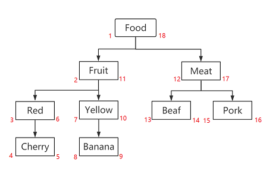

[官网](https://zhangfisher.github.io/flextree/) | [English](./readme.md) 

`FlexTree`是`Nodejs`下一个基于左右值算法的树结构库，它提供了一种简单的方式来存储和操作树形结构数据。
`FlexTree`提供了简单而丰富的`API`让你可以轻松的操作树，如增删改查、遍历、移动、查询等。

**主要特性：**

- 基于左右值算法，高效的树结构存储和访问
- 简单易用的`API`
- 丰富的树操作，如增删改查、遍历、移动、查询等
- 采用`TypeScript`开发，提供完整友好的类型定义
- 支持任意数据库存储，如`SQLite`、`MySQL`、`PostgreSQL`等
- `95%+`的测试覆盖率，保证代码质量
- 适用`Node.js`环境


# 了解树模型

在开发`Nodejs`应用时，当需要在数据库中存储树时，常见的存储结构有以下几种：

- 邻接列表结构
- 路径枚举结构
- 嵌套树结构
- 闭包表结构

以上算法各有优缺点，应该根据实际的应用场景选择合适的算法。

`嵌套树模型（Nested Set Model）`也被称为`左右值`模型，它是一种用于存储树形结构数据的方法，通过两个字段（通常被称为 `lft` 和 `rgt`）来表示节点在树中的位置。

在嵌套树模型中，每个节点的`lft`值都小于其所有子节点的`lft`值，`rgt`值都大于其所有子节点的 `rgt` 值。这样，我们可以通过一个简单的查询来获取一个节点的所有后代，只需要查找`lft` 和 `rgt` 值在这个范围内的所有节点即可。

嵌套树模型的左右值分布方式是通过`深度优先遍历（Depth-First Search）`来确定的。在遍历过程中，每当进入一个节点时，就分配一个 `lft` 值，每当离开一个节点时，就分配一个 `rgt` 值。这样，每个节点的 `lft` 和 `rgt` 值就形成了一个区间，这个区间内的所有值都对应该节点的子节点。



例如，下面是一个嵌套树模型的例子：

| id | leftValue | rightValue | name |
|----|-----|-----|------|
| 1  | 1   | 14  | root |
| 2  | 2   | 9   | A    |
| 3  | 10  | 11  | B    |
| 4  | 12  | 13  | C    |
| 5  | 3   | 4   | A-1  |
| 6  | 5   | 6   | A-2  |
| 7  | 7   | 8   | A-3  |

<ul>
    <li>
        root
        <ul>
            <li>A
                <ul>
                    <li>A-1</li>
                    <li>A-2</li>
                    <li>A-3</li>
                </ul>
            </li>
            <li>B</li>
            <li>C</li>
    </li>
</ul>

# 快速开始


## 第1步：安装核心库

首先安装`flextree`核心库。

```ts
npm install flextree
// or
yarn add flextree
// or
pnpm add flextree
```

## 第2步：配置数据库适配器

接下来，取决于您的应用是如何访问数据库，你需要安装相应的数据库适配器。

本例中，我们使用`Sqlite`，安装数据库安装`flextree-sqlite-adapter`。

```ts
npm install flextree-sqlite-adapter
// or
yarn add flextree-sqlite-adapter
// or
pnpm add flextree-sqlite-adapter
```

`flextree-sqlite-adapter`是`flextree`的`sqlite3`数据库驱动，基于`sqlite3`数据库存储。


如果你使用的是`MySQL`、`PostgreSQL`等数据库，可以安装对应的驱动，如`flextree-prima-adapter`，或者基于`flextree`提供的`IFlexTreeAdapter`自定义驱动。


## 第3步：创建树表

接下来，我们需要在数据库中创建**组织架构树表`org`**。

如果你使用的是`sqlite`数据库，可以使用以下`sql`语句创建表：

```ts
import SqliteAdapter from 'flextree-sqlite-adapter';

const sqliteAdapter = new SqliteAdapter("org.db")
await sqliteAdapter.open()
await sqliteAdapter.exec(`
    CREATE TABLE IF NOT EXISTS  org (
        id INTEGER PRIMARY KEY AUTOINCREMENT,
        name VARCHAR(60),  
        level INTEGER,  
        leftValue INTEGER, 
        rightValue INTEGER,
`)

```

以上，我们他创建了一个`org`表，包含以下字段：

| 字段名 | 类型 | 说明 |
| --- | --- | --- |
| `id` | INTEGER | 主键,自增 |
| `name` | VARCHAR(60) | 名称 |
| `level` | INTEGER | 层级 |
| `leftValue` | INTEGER | 左值 |
| `rightValue` | INTEGER | 右值 |

一般情况下，以上字段是必须的，你可以根据实际情况添加其他字段。


**提示**：一般情况下，创建表是由应用程序自行完成的,`flextree`不负责创建表。本节仅演示需要创建的树表结构。


## 第4步：创建树管理器

接下来，我们创建一个组织架构树管理器`OrgManager`，用于管理组织架构树。

```ts {7-9}
import { FlexTreeManager } from 'flextree';
import SqliteAdapter from 'flextree-sqlite-adapter';

const sqliteAdapter = new SqliteAdapter("org.db")
await sqliteAdapter.open()

const orgManager = new FlexTreeManager("org",{
    adapter: sqliteAdapter     
})
```

## 第5步：添加树节点

然后我们就可以开始向组织架构树中添加节点了。 

```ts
// 创建一个根节点
await orgManager.createRoot({
    name: "A公司"
})
// 添加组织架构的一级部门子节点
await orgManager.addNodes([
    { name: "行政中心" },
    { name: "市场中心" },
    { name: "研发中心"} 
])
 
// 添加行政中心的部门子节点.
const node = await orgManager.findNode({name:"行政中心"})
await orgManager.addNodes( [
        { name: "总裁办" },
        { name: "人力资源部" },
        { name: "财务部" },
        { name: "行政部" },
        { name: "法务部" },
        { name: "审计部" }
    ],node)   // 添加为node的子节点

```
 
我们可以使用`addNodes`方法向树中添加节点，`addNodes`方法支持批量添加节点，支持多种形式的添加子节点。
 
## 第6步：访问树

以上我们已经创建了一棵完整的树，接下来我们可以通过两种形式来访问树。

- 通过`FlexTreeManager`访问树
- 通过`FlexTree`对象访问树

### 获取节点

```ts
// 获取所有节点
await orgManager.getNodes() 
// 限定层级获取节点，仅获取第1-3层节点，不包含第4层及以下节点
await orgManager.getNodes(3) 
// 根据id获取节点
await orgManager.getNode(1) 
// 获取树根节点
await orgManager.getRoot()

// 获取name=行政中心的节点
const node = await orgManager.findNode({name:"行政中心"})
// 获取节点<行政中心>的子节点集
await orgManager.getChildren(node)
// 获取节点<行政中心>的所有后代节点集
await orgManager.getDescendants(node)
// 获取节点<行政中心>的所有后代节点集，包括自身
await orgManager.getDescendants(node,{includeSelf:true})
// 获取节点<行政中心>的所有后代节点集，包括限定层级
await orgManager.getDescendants(node,{level:2})
// 获取节点<行政中心>的子节点集,level=1相当于只获取直接子节点
await orgManager.getDescendants(node,{level:1})

// 获取节点<行政中心>的所有祖先节点集
await orgManager.getAncestors(node) 
// 获取节点<行政中心>的父节点
await orgManager.getParent(node) 
// 获取节点<行政中心>的所有兄弟节点集
await orgManager.getSiblings(node)  
// 获取节点<行政中心>的所有兄弟节点集，包括自身
await orgManager.getSiblings(node,{includeSelf:true})  
// 获取节点<行政中心>的前一个兄弟节点
await orgManager.getNextSibling(node)
// 获取节点<行政中心>的后一个兄弟节点
await orgManager.getPrevSibling(node)

```

### 查找节点

```ts
// 查找name=行政中心的节点,只返回第一个满足条件的节点
await orgManager.findNode({name:"行政中心"})
// 查找所有level=1的节点集
await orgManager.findNodes({level:1})

```

:::warning 提示
`FlexTree`只提借供简单的查询功能，如果需要更复杂的查询，可以使用数据库的查询功能。
:::


### 移动节点

```ts
import { FirstChild, LastChild,PreviousSibling,NextSibling } from 'flextree'
const admin = await orgManager.findNode({name:"行政中心"})
const market = await orgManager.findNode({name:"市场中心"})

// 将行政中心移动到市场中心下，成为其最后一个子节点
await orgManager.move(admin,market)  
await orgManager.move(admin,market,LastChild)  // 与上面等价
// 将行政中心移动到市场中心下，成为其第一个子节点
await orgManager.move(admin,market,FirstChild)
// 将行政中心移动到市场中心前，成为其前一个兄弟节点
await orgManager.move(admin,market,PreviousSibling)
// 将行政中心移动到市场中心后，成为其后一个兄弟节点
await orgManager.move(admin,market,NextSibling)

// 将行政中心上移
await orgManager.moveUpNode(admin)  
// 将行政中心下移
await orgManager.moveDownNode(admin)  

```

### 删除节点

```ts
const admin = await orgManager.findNode({name:"行政中心"})
// 删除行政中心节点以及其所有后代节点
await orgManager.deleteNode(admin)
// 清空树
await orgManager.clear()  
```


### 查询节点关系

```ts

const admin = await orgManager.findNode({name:"行政中心"})
const market = await orgManager.findNode({name:"市场中心"})

// 返回admin节点与market节点的关系
const relation = await getNodeRelation(admin,market)

// relation取值范围
export enum FlexTreeNodeRelation {
    Self = 0,
    Parent = 1,
    Child = 2,
    Siblings = 3,
    Descendants = 4,
    Ancestors = 5,
    DiffTree = 6,
    SameTree = 7,
    SameLevel = 8,
    Unknow = 9,
} 
 
```

# 推荐

- [全流程一健化React/Vue/Nodejs国际化方案 - VoerkaI18n](https://zhangfisher.github.io/voerka-i18n/)
- [无以伦比的React表单开发库 - speedform](https://zhangfisher.github.io/speed-form/)
- [终端界面开发增强库 - Logsets](https://zhangfisher.github.io/logsets/)
- [简单的日志输出库 - VoerkaLogger](https://zhangfisher.github.io/voerkalogger/)
- [装饰器开发 - FlexDecorators](https://zhangfisher.github.io/flex-decorators/)
- [有限状态机库 - FlexState](https://zhangfisher.github.io/flexstate/)
- [通用函数工具库 - FlexTools](https://zhangfisher.github.io/flex-tools/)
- [小巧优雅的CSS-IN-JS库 - Styledfc](https://zhangfisher.github.io/styledfc/)
- [为JSON文件添加注释的VSCODE插件 - json_comments_extension](https://github.com/zhangfisher/json_comments_extension)
- [开发交互式命令行程序库 - mixed-cli](https://github.com/zhangfisher/mixed-cli)
- [强大的字符串插值变量处理工具库 - flexvars](https://github.com/zhangfisher/flexvars)
- [前端link调试辅助工具 - yald](https://github.com/zhangfisher/yald)
- [异步信号 - asyncsignal](https://github.com/zhangfisher/asyncsignal)
- [捆绑Vue组件CSS到JS的插件 - vite-plugin-vue-style-bundler ](https://github.com/zhangfisher/vite-plugin-vue-style-bundler)
- [轻量树组件 - LiteTree](https://github.com/zhangfisher/lite-tree)
